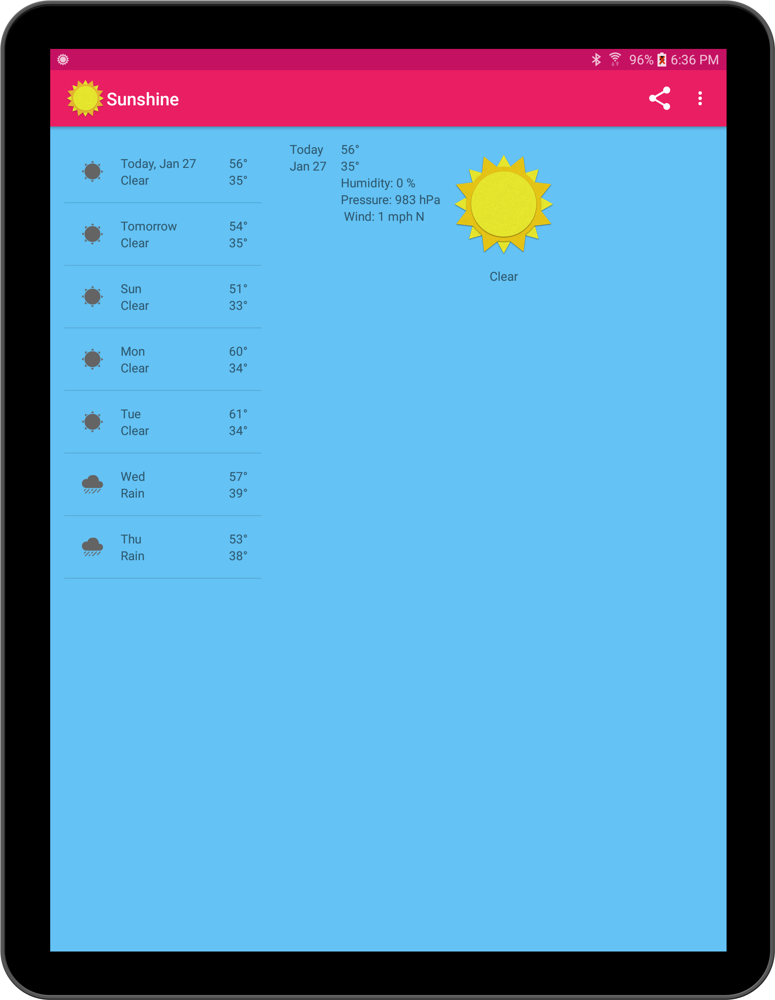

Sunshine
========

The app connects to a restful API which returns JSON data which is then parsed and displayed. app also has the abilty to show the map location of the zip code location, change the location zip code, display the temp in metric or imperial units, and a refresh menu item to check for updated weather data. 

App implements a master / detail or two-pane display, with the days of the week on the left side and a right pane with weather details. 
